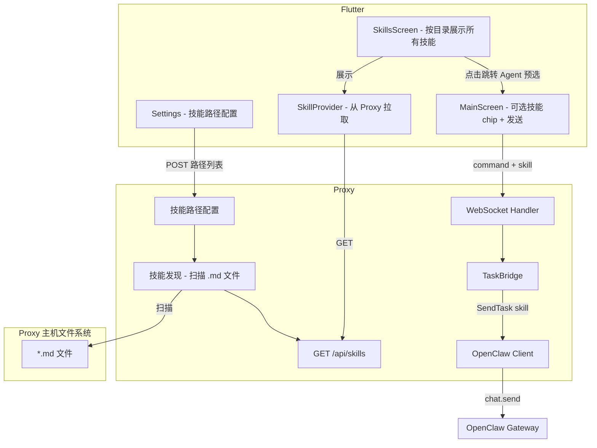

# OpenClaw 统一界面 - 技能配置与指定

将 xassistant 作为 OpenClaw 统一界面，支持配置技能路径、发现并展示技能，在交互时指定技能进行对话。

## 现状分析

**已有能力**

- Proxy 已有 `SendTaskToAgent(prompt, skill, priority)`，且 REST `/api/openclaw/task` 支持 `skill` 参数
- `proxy/openclaw/client.go` 的 `SendTask` 接收 `skill` 但**未传入** `ChatSendParams`（该结构体目前无 Skill 字段）
- WebSocket 命令 payload 仅有 `text`、`working_dir`，Flutter `sendCommand` 无 skill 参数

**缺失能力**

1. 技能路径配置（Settings）
2. 技能发现（Proxy 扫描路径下的 `.md` 文件）
3. 技能列表展示 UI，展示/获取 skill 的 md 内容
4. 聊天时指定技能并传递给 Proxy

---

## 架构概览

路径在 Proxy 所在机器（用户电脑）上，由 Proxy 读取本地文件系统；Flutter 通过 API 获取技能列表。

---

## 实现方案

### 1. 技能路径配置（Proxy + Settings）

**Proxy 侧**

- 新增 `proxy/skills/` 模块：扫描配置路径下的 **`.md` 文件**，每个 .md 视为一个技能
- 技能路径配置持久化：`{workDir}/config/skill_paths.json`（JSON 数组）
- 新增 API：
  - `GET /api/skills`：返回技能列表（id=文件名不含扩展名，name=首行标题或文件名，含 md 路径）
  - `GET /api/skills/:id/content`：返回指定技能的 **md 内容**（按 path + id.md 定位）
  - `GET /api/config/skill-paths`：返回当前配置的技能路径
  - `POST /api/config/skill-paths`：更新技能路径（body: `{ "paths": ["/path/to/skill1", "~/skills/skill2"] }`）
- 支持绝对路径和 `~` 扩展；每个路径指向技能目录，扫描该目录下所有 `.md` 文件

**Flutter 侧** `lib/presentation/screens/settings/settings_screen.dart`

- 在 Settings 中新增「OpenClaw 技能」区块
- 从 Proxy `GET /api/config/skill-paths` 加载路径，支持添加/删除/编辑技能路径
- 通过 `POST /api/config/skill-paths` 同步到 Proxy

### 2. 技能模型与服务（Flutter）

**新增文件**

- `lib/models/skill_model.dart`：`SkillModel(id, name, path, content?)` — id 来自 .md 文件名，name 来自首行或文件名，content 为 md 正文（按需拉取）
- `lib/services/skill_api_service.dart`：调用 `GET /api/skills` 获取列表，`GET /api/skills/:id/content` 获取 md 内容
- `lib/providers/skill_provider.dart`：`AsyncValue<List<SkillModel>>`，连接时从 Proxy 拉取，支持手动刷新

**技能来源**：配置路径下每个 `.md` 文件 = 一个技能（如 `plan-work.md` → id: `plan-work`）。

### 3. 技能展示 UI：单独 Skills 页面

**Skills 页面**（新建 `lib/presentation/screens/skills/skills_screen.dart`）

- 在主导航增加「技能」Tab（底部导航：首页、任务、Agent、**技能**、设置）
- 列表展示对应目录下的**所有技能**（来自 .md 文件），按技能源路径分组
- 每个技能展示：`name`（来自首行或文件名）、所属路径；点击可查看/获取该技能的 **md 内容**
- 点击技能：可跳转到 Agent 并预选该技能，下次发送时携带 `skill` 参数
- 支持下拉刷新，从 Proxy `GET /api/skills` 重新拉取

**Agent 页面**（MainScreen）

- 输入框上方增加当前选中技能的 chip/标签（若从 Skills 跳转并预选，或用户此前选择）
- 发送时若已选技能则携带 `skill` 参数

### 4. 端到端传递技能

| 层级 | 修改点 |
|------|--------|
| Flutter `sendCommand` | 新增可选参数 `skill`，写入 `payload['skill']` |
| Flutter `_sendMessage` | 从当前选中技能读取 `skillId`，传给 `sendCommand` |
| Proxy `websocket/client.go` | 解析 `payload.Skill`，调用 `executeOpenClawCommand(commandID, text, skill)` |
| Proxy `openclaw/client.go` | `ChatSendParams` 增加 `Skill string`，`SendTask` 中 `params.Skill = skill` |

### 5. OpenClaw Gateway 兼容性

- `ChatSendParams` 增加 `Skill` 字段；若 Gateway 暂不支持，通常会忽略未知字段，不影响现有流程
- 若后续 Gateway 支持 `skill_invoke` 等专用方法，可再扩展

---

## 关键文件与代码位置

| 功能 | 文件 | 说明 |
|------|------|------|
| 技能路径配置 API | `proxy/server/server.go`、`proxy/skills/`（新建） | GET/POST `/api/config/skill-paths`，扫描 .md 发现技能 |
| 技能 API | `proxy/server/server.go` | GET `/api/skills` 列表，GET `/api/skills/:id/content` 获取 md |
| 技能配置 UI | `lib/presentation/screens/settings/settings_screen.dart` | 新增「OpenClaw 技能」区块，管理技能路径 |
| 技能模型 | `lib/models/skill_model.dart`（新建） | SkillModel 定义 |
| 技能 API 调用 | `lib/services/skill_api_service.dart`（新建） | 调用 /api/skills、/api/skills/:id/content 获取 md、/api/config/skill-paths |
| 技能状态 | `lib/providers/skill_provider.dart`（新建） | 技能列表 Provider |
| Skills 页面 | `lib/presentation/screens/skills/skills_screen.dart`（新建） | 按目录分组展示 .md 技能，可查看 md 内容，点击跳转 Agent 预选 |
| 路由与导航 | `lib/app/router.dart`、`lib/presentation/screens/shell/app_shell.dart` | 新增 `/skills` 分支及「技能」底部 Tab |
| Agent 技能 chip | `lib/presentation/screens/main/main_screen.dart` | 当前选中技能展示 + 发送时传入 skill |
| WebSocket 发送 | `lib/services/websocket_service.dart` | `sendCommand` 增加 `skill` 参数 |
| 命令解析 | `proxy/websocket/client.go` | 解析 `skill`，传给 `executeOpenClawCommand` |
| OpenClaw 请求 | `proxy/openclaw/client.go`、`proxy/openclaw/messages.go` | `ChatSendParams.Skill`、`SendTask` 传参 |

---

## 数据流

1. 用户在 Settings 添加技能路径（如 `/Users/me/openclaw-skills/software-dev-agent`）→ `POST /api/config/skill-paths` 同步到 Proxy
2. Proxy 持久化路径，扫描各路径下的 `.md` 文件，汇总技能列表
3. Flutter `SkillProvider` 连接时 `GET /api/skills` 拉取列表
4. **Skills 页面**：按目录分组展示所有技能；点击某技能可跳转 Agent 并预选该技能
5. **Agent 页面**：若已预选技能则显示 chip；用户输入并发送 → `sendCommand(commandId, text, skill: selectedSkillId)` → WebSocket `command` payload 包含 `skill`
6. Proxy 解析 payload → `SendTaskToAgent(text, skill, "p1")` → OpenClaw `chat.send` 携带 `skill`
