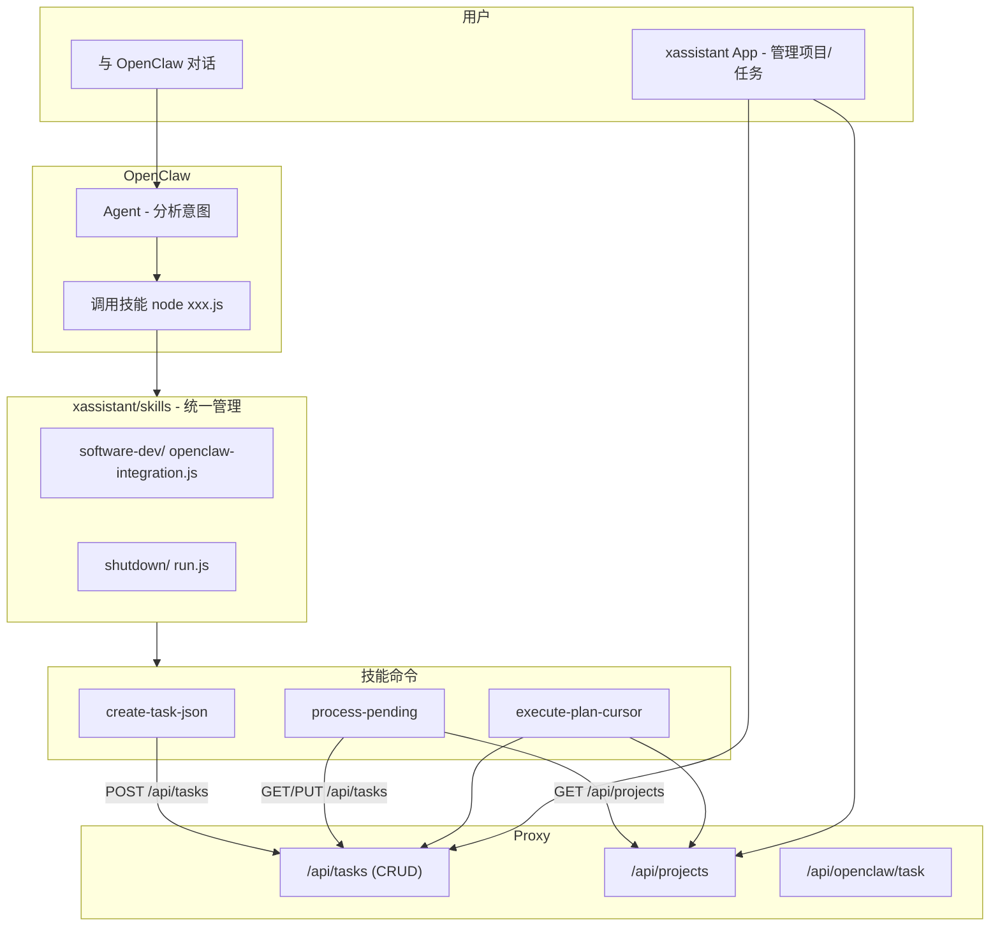

# xassistant 技能与任务统一重构方案

## 核心原则

- **技能统一在当前项目（xassistant）管理**：`xassistant/skills/` 为技能根目录
- **技能全部 JS 实现**：便于扩展、跨平台、易迭代
- **技能由 OpenClaw 调用**：用户将 `xassistant/skills/` 软连到 OpenClaw，OpenClaw 分析对话并执行 `node skills/xxx/run.js` 等
- **Proxy 提供任务相关接口**：不执行技能，只提供任务/项目 CRUD 等 API
- **技能调用 Proxy**：创建任务、获取项目时，技能通过 HTTP 请求 Proxy

## 架构图



## 1. 技能统一在 xassistant 项目管理

- **技能根目录**：`xassistant/skills/`，所有技能在此统一管理
- **目录结构**：每个技能一个子目录，内含 SKILL.md、JS 入口（如 `openclaw-integration.js` 或 `run.js`）
- **与 OpenClaw 对接**：用户将 `xassistant/skills/` 软连到 OpenClaw 的 skills 路径，例如：

```bash
ln -sf /path/to/xassistant/skills ~/.openclaw/skills/xassistant
```

- **调用方式**：OpenClaw Agent 根据对话意图执行 `node skills/software-dev/openclaw-integration.js create-task-json ...`

## 2. Proxy 任务接口（已有 + 补齐）

Proxy 专注提供任务相关 API，技能通过 HTTP 调用：

| 接口 | 用途 | 现状 |
|------|------|------|
| GET /api/tasks | 列表（支持 ?status=） | 已有 |
| GET /api/tasks/:id | 单任务 | 已有 |
| POST /api/tasks | 创建 pending 任务 | 已有 |
| PUT /api/tasks/:id | 更新（taskId、planPath、status） | 已有 |
| DELETE /api/tasks/:id | 删除 | 已有 |
| GET /api/projects | 项目列表 | 已有 |
| GET /api/projects/:key | 单个项目（含 path） | 已有 |
| POST /api/openclaw/task | 发送任务到 Agent | 已有 |

**需补齐**：

- `ListTasks` 返回格式与 tasks-store-remote.js 一致：`{ tasks: [...] }`（已有）
- `CreateTask` 返回单对象，含 id、title、projectKey、status=pending 等（已有）
- 技能侧需 project 信息写 plan 文件：`GET /api/projects/:key` 返回 `{ path, name, techStack, ... }`

## 3. 技能 JS 实现调用 Proxy

software-dev-agent-skill 已支持：

- `config.json` 中 `settings.taskApiUrl` 指向 Proxy 地址
- `tasks-store-resolver.js` 选用 `tasks-store-remote` 调用 Proxy
- tasks-store-remote.js 实现与 Proxy `/api/tasks` 对接

**需改造**：`project-resolver.js` 从 Proxy `GET /api/projects` 获取项目，替代 `config.json` 的 `projects.registry`。

新增 `project-resolver-remote.js`（或扩展 resolver）：

- 当 `taskApiUrl` 存在时，从 `GET {taskApiUrl}/api/projects` 拉取项目
- 按 key 查找，返回 `{ path, name, techStack }` 供写 plan 使用

## 4. 配置与认证

- **Proxy 地址**：技能 `config.json` 中 `settings.taskApiUrl: "http://localhost:8765"`
- **Token**：`settings.taskApiToken` 可选，Proxy 的 `withTaskAuth` 支持 `?token=` 或 `Authorization: Bearer`
- **localhost 免鉴权**：Proxy 启动时 `--allow-local-no-auth` 时，本机请求可跳过 token

## 5. xassistant App 角色

- **项目管理**：通过 Proxy `/api/projects` 增删改，Flutter 已有 CapabilitiesScreen 项目区块
- **任务列表/详情**：通过 Proxy `/api/tasks` 展示，TaskListScreen、TaskDetailScreen 已有
- **开发能力入口**：CapabilitiesScreen 的「创建任务」「自动开发」可保留为快捷入口，直接调 Proxy：
  - 创建任务：`POST /api/tasks` 或 `POST /api/capabilities/execute`（Proxy 内部 CreateWithPlan）
  - 发送给 Agent：`POST /api/openclaw/task` 携带 prompt + skill，由 OpenClaw 后续调用技能

CapabilitiesScreen 不再「发现并执行技能」，而是调用 Proxy 提供的任务/能力接口；技能实际执行仍在 OpenClaw 侧。

## 6. 关键改造清单

| 模块 | 文件 | 变更 |
|------|------|------|
| xassistant | `skills/software-dev/` | 从 software-dev-agent-skill 迁入，含 openclaw-integration.js、openclaw-plan-workflow、tasks-store-remote、project-resolver 等 |
| 技能 | `skills/*/config.json` | taskApiUrl 指向 Proxy，project-resolver 从 Proxy GET /api/projects 获取项目 |
| Proxy | `proxy/server/server.go` | 确认 /api/tasks、/api/projects 与 skills 调用格式兼容 |
| Flutter | CapabilitiesScreen | 保持「创建任务 + 发送 Agent」快捷入口，调 Proxy |

## 7. 技能迁入 xassistant

将 software-dev-agent-skill 迁入为 `xassistant/skills/software-dev/`：

```
xassistant/skills/
├── shutdown/           # 纯上下文或简单 JS
│   ├── SKILL.md
│   └── run.js          # 可选，若有执行逻辑
└── software-dev/       # 迁入 software-dev-agent-skill
    ├── SKILL.md
    ├── openclaw-skill.json
    ├── openclaw-integration.js
    ├── openclaw-plan-workflow.js
    ├── tasks-store-adapter.js
    ├── tasks-store-remote.js
    ├── tasks-store-resolver.js
    ├── project-resolver.js      # 改造：从 Proxy 取项目
    ├── config.json              # taskApiUrl 指向 Proxy
    └── capabilities/
        └── ...
```

## 8. 数据流示例

1. **用户说「创建任务：库存同步API，项目 my-project」**
   - OpenClaw 调用 `node skills/software-dev/openclaw-integration.js create-task-json "库存同步API" "..." my-project`
   - 技能 `createTaskSkill` → `tasks-store-remote.createTask` → Proxy `POST /api/tasks`
   - 技能 `processPendingSkill` → `GET /api/tasks?status=pending` → `GET /api/projects/my-project` 取 path → 本地写 plan 文件 → `PUT /api/tasks/:id` 更新 taskId、planPath、status=planned

2. **用户在 App 查看任务**
   - Flutter `GET /api/tasks` → Proxy → 展示列表

3. **用户点击「自动开发」发送给 Agent**
   - Flutter `POST /api/openclaw/task` { prompt, skill: "execute-plan-cursor" }
   - OpenClaw 收到后，后续可能再调用 `node openclaw-integration.js execute-plan-cursor ...`，技能内部再调 Proxy 获取任务/项目
