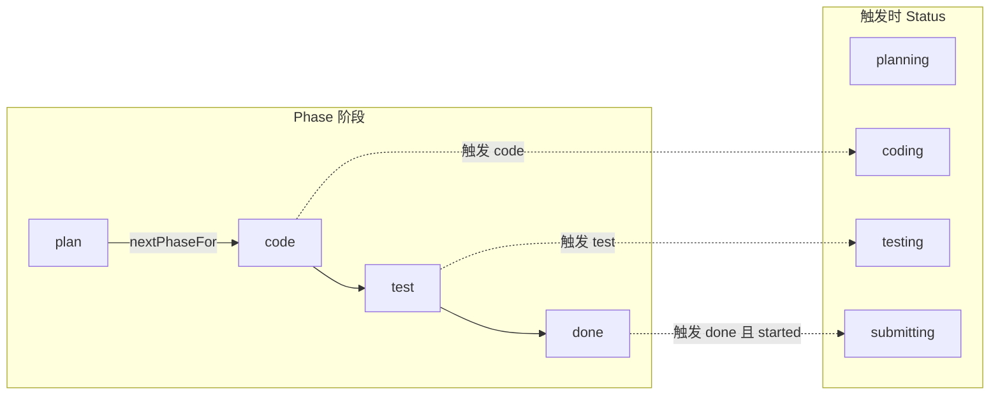
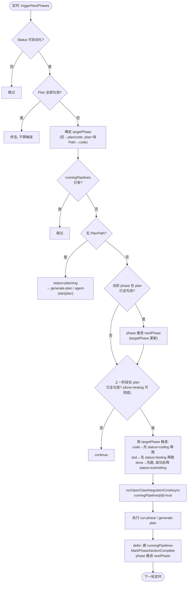
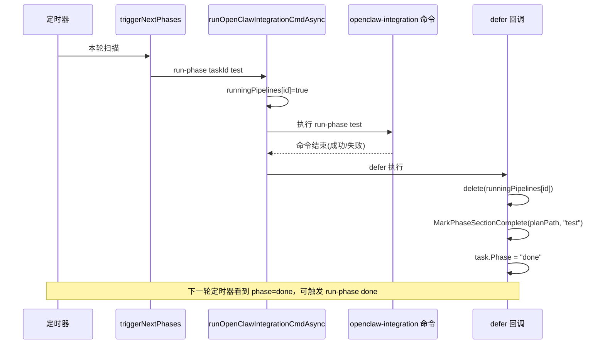

# 任务状态与阶段流转机制

本文档描述 Proxy 与 Flutter 侧任务 **Status（状态）**、**Phase（阶段）** 的取值、推进条件及自动触发的整体流转机制。

---

## 一、状态与阶段定义

### 1.1 Status（任务状态）

与 Flutter `TaskStatus` 枚举及 plan 元数据同步保持一致。

| 常量 | 值 | 含义 |
|------|-----|------|
| `pending` | pending | 待确认 |
| `confirmed` | confirmed | 已确认，等待执行 |
| `planned` | planned | 已计划 |
| `planning` | planning | 计划中 |
| `coding` | coding | 执行中（开发阶段） |
| `testing` | testing | 测试中 |
| `submitting` | submitting | 提交中 |
| `inProgress` | inProgress | 执行中（兼容） |
| `completed` | completed | 已完成 |
| `cancelled` | cancelled | 已取消 |
| `failed` | failed | 执行失败 |

**可参与自动化的状态**（`triggerNextPhases` 会处理）：  
`planned`、`inProgress`、`pending`、`confirmed`、`testing`、`submitting`。

### 1.2 Phase（执行阶段）

用于多阶段流水线（plan → code → test → done），与 plan 文件中的 Execution Log 区块一一对应。

| Phase | 含义 | Plan 中区块标题 |
|-------|------|------------------|
| `plan` | 计划 | ### Plan 阶段 |
| `code` | 代码 | ### Code 阶段 |
| `test` | 测试 | ### Test 阶段 |
| `done` | 完成/提交 | ### Done 阶段 |

**阶段顺序**（`nextPhaseFor` / `prevPhaseFor`）：

- `plan` → `code` → `test` → `done`（`done` 之后无下一阶段）
- 触发某阶段前，要求**上一阶段**在 plan 中已勾选完成（见下）。

---

## 二、流转触发源

### 2.1 定时轮询：runPhaseWatcher

- **入口**：`proxy/server/server.go` 中 `runPhaseWatcher()`，按 `phaseWatcherInterval`（默认 20 秒，可通过 `-phase-watcher-interval` 或环境变量 `PHASE_WATCHER_INTERVAL` 配置）轮询。
- **每次执行**：`triggerNextPhases()` 遍历所有任务，对满足条件的任务决定是否触发「生成计划」或「run-phase」。

### 2.2 单次 run-phase 完成：defer 回调

- **入口**：`runOpenClawIntegrationCmdAsync` 内部 goroutine 的 `defer`。
- **时机**：某次 `run-phase <phase>` 命令**无论成功失败**，只要 goroutine 退出就会执行。
- **动作**：
  1. 从 `runningPipelines` 中移除该任务。
  2. 若是 `run-phase` 且 `args` 中有阶段名：
     - 调用 `MarkPhaseSectionComplete(planPath, completedPhase)`，将 plan 中该阶段下所有 `- [ ]` 改为 `- [x]`。
     - 调用 `nextPhaseFor(completedPhase)` 得到下一阶段，写回 `task.Phase`（例如 test → done）。

因此：**run-phase test 结束后**，phase 会被推进为 `done`，且 plan 中 Test 阶段会被标记完成；下一轮定时器即可根据 phase=done 触发 run-phase done。

---

## 三、triggerNextPhases 逻辑概要

对每个任务依次执行以下判断（顺序重要）。

### 3.1 是否参与自动化

- `task.Status` 必须在：  
  `planned`、`inProgress`、`pending`、`confirmed`、`testing`、`submitting`。
- 否则直接跳过。

### 3.2 终态：plan 全部勾选完成

- 若 `task.PlanPath != ""`，用 `ParsePlanProgress(planPath)` 统计 Execution Log 下已完成/总 checkbox 数。
- 若 `total > 0` 且 `completed == total`，认为「plan 已全部完成」，**不再触发**任何阶段。

### 3.3 确定 targetPhase

- 默认 `targetPhase = task.Phase`。
- 若 phase 为空：无 plan 则为 `plan`，有 plan 则为 `code`。
- **特殊**：若 `targetPhase == "plan"` 且已有 `PlanPath`，则改为 `code` 并写回（计划已存在，直接进入代码阶段）。

### 3.4 是否正在运行

- 若 `runningPipelines[task.ID] == true`（该任务已有 run-phase / generate-plan 在跑），**本轮不触发**，跳过。

### 3.5 无 plan：触发生成计划

- 条件：  
  `(Status in confirmed/pending/inProgress)` 且 `PlanPath == ""`。
- 若有 `ProjectKey`：将 status 置为 `planning`，调用 `runAgentStartSkillAsync(task, "plan")`（tmux 中 agent-start phase=plan）。
- 若无 `ProjectKey`：调用 `runOpenClawIntegrationCmdAsync(task.ID, "generate-plan", ...)`。
- 处理后 `continue`，本轮不再做后续阶段判断。

### 3.6 有 plan：推进 phase（plan 勾选完成度）

- 条件：  
  `PlanPath != ""` 且 Status 在 `planned / inProgress / confirmed / testing / submitting`。
- 若 `targetPhase != "plan"` 且 **当前阶段在 plan 中已全部勾选**：  
  `IsPhaseCompleted(planPath, targetPhase) == true`  
  则：
  - 计算 `nextPhase = nextPhaseFor(targetPhase)`（如 test → done）；
  - 写回 `task.Phase = nextPhase`；
  - 将本轮的 `targetPhase` 更新为该 `nextPhase`，**同一轮**即可继续往下触发该下一阶段。

### 3.7 有 plan：上一阶段是否完成

- `prevPhase = prevPhaseFor(targetPhase)`（如 targetPhase=done → prevPhase=test）。
- 若 `prevPhase != ""` 且 **plan 中上一阶段未全部勾选**：  
  `!IsPhaseCompleted(planPath, prevPhase)`  
  则 **本次不触发**，`continue`。
- **兜底**：若 `targetPhase == "done"` 且 `task.Status == testing`，可视为 run-phase test 刚完成并已推进到 done，即使 plan 里 Test 未标记也允许触发 run-phase done（避免因 plan 未写入或格式问题导致永不触发提交阶段）。  
  （若代码中已实现该兜底，则此处会放行。）

### 3.8 写 status 与触发 run-phase

- 根据 `targetPhase` 决定要写的 status：
  - `code` → `coding`
  - `test` → `testing`
  - `done` → `submitting`
- **code / test**：**先**写 status，**再**调用 `runOpenClawIntegrationCmdAsync(task.ID, "run-phase", runPhaseArgs)`。
- **done**：**先**调用 `runOpenClawIntegrationCmdAsync`，**仅当返回 `started == true`** 时再写 status = `submitting`。  
  这样可避免「未真正启动 run-phase done 却已把状态改为提交中」，导致下一轮误判而不触发 done。
- 调用 `runOpenClawIntegrationCmdAsync` 时会在内部设置 `runningPipelines[task.ID] = true`，命令结束的 defer 中再删除。

---

## 四、Phase 与 Plan 的对应关系

### 4.1 Plan 中区块标题（phaseSectionMarkers）

- `plan` → `### Plan 阶段`
- `code` → `### Code 阶段`
- `test` → `### Test 阶段`
- `done` → `### Done 阶段`

### 4.2 IsPhaseCompleted(planPath, phase)

- 在 plan 文件中找到对应 `### X 阶段` 区块。
- 在该区块内（直到下一个 `###` 或 `##`）若存在任意一行以 `- [ ]` 开头，返回 `false`。
- 否则（该区块存在且无未勾选项）返回 `true`。

### 4.3 MarkPhaseSectionComplete(planPath, phase)

- 在 run-phase 完成的 **defer** 中调用。
- 将对应阶段区块内所有 `- [ ]` 替换为 `- [x]`，使下一轮 `IsPhaseCompleted(planPath, prevPhase)` 为 true，从而允许触发下一阶段。

---

## 五、流转图

### 5.1 Phase 阶段顺序与 Status 对应

### 5.2 triggerNextPhases 决策与 run-phase 闭环

### 5.3 run-phase 完成后的 Phase 推进（defer）

**Phase 推进链**（两种来源）：

1. **定时器**：根据 plan 勾选情况，在同一轮内可能先推进 phase 再触发（如 test 全勾选 → phase 改为 done → 触发 run-phase done）。
2. **defer**：run-phase 命令结束时推进 phase（如 run-phase test 结束 → phase 改为 done），并标记 plan 中该阶段完成。

**Status 与 Phase 的对应**（触发时）：

- 触发 **code** → status 置为 `coding`
- 触发 **test** → status 置为 `testing`
- 触发 **done** → 仅在实际成功启动 run-phase 后置为 `submitting`

---

## 六、相关配置与代码位置

| 项 | 说明 |
|----|------|
| `phaseWatcherInterval` | 阶段轮询间隔（秒），默认 20；flag `-phase-watcher-interval` 或 env `PHASE_WATCHER_INTERVAL` |
| `runningPipelines` | 内存 map，防止同一任务并发触发多个 run-phase/generate-plan |
| `proxy/server/server.go` | `triggerNextPhases`、`runPhaseWatcher`、`runOpenClawIntegrationCmdAsync` 及其 defer、`nextPhaseFor`、`prevPhaseFor` |
| `proxy/tasks/plan_template.go` | `IsPhaseCompleted`、`MarkPhaseSectionComplete`、`phaseSectionMarkers` |
| `proxy/tasks/model.go` | Status 常量、Task 结构体 |

---

## 七、设计要点小结

1. **防重**：`runningPipelines` 保证同一任务同一时间只跑一个 run-phase/generate-plan；status 在触发前（code/test）或触发成功后（done）更新，避免重复触发。
2. **done 的 status 延后**：只有成功启动 run-phase done 才设为「提交中」，避免「已是提交中但未真正触发 done」导致下一轮不再触发。
3. **双源推进 phase**：既可由「plan 勾选完成」在定时器里推进，也可由「run-phase 结束」在 defer 里推进；两者结合保证 test 完成后能进入并触发 done。
4. **终态**：Execution Log 全部勾选后不再触发，避免无限循环。

以上为当前 Proxy 侧任务状态与阶段流转的整体机制说明。
