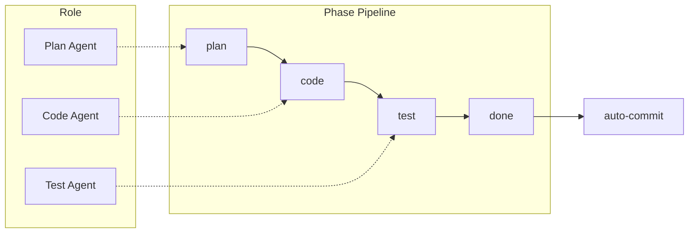

# 任务生命周期与多 Agent 全面整改

## 一、任务生命周期补全

**现状**：[proxy/tasks/model.go](proxy/tasks/model.go) 中任务有 `status`（如 pending, inProgress, completed），但缺少明确的状态机与「完成」后的闭环（如通知、清理 tmux）。

**目标**：定义清晰的状态流转，并在「完成/失败」时触发清理与通知。

- **状态定义**（保持与现有一致，补文档）：`pending` → `planned`（已有 plan）→ `inProgress`（执行中）→ `completed` / `failed` / `cancelled`。
- **变更点**：
  - 在 [proxy/tasks/store.go](proxy/tasks/store.go) 的 `CreateFromOpenClaw` / 更新逻辑中，当 `status == "completed"` 或 `"cancelled"` 时，若任务带有 tmux 元数据（`TmuxPaneId`），**触发 tmux 回收**（见下一节）。
  - 可选：在 [proxy/openclaw/task_bridge.go](proxy/openclaw/task_bridge.go) 的 `handleTaskEvent` 中，当 `action == "complete"` 时，在写入 store 后调用同一套「完成时清理」逻辑，保证从 OpenClaw 推送的完成也能回收 tmux。

---

## 二、Tmux 任务完成后自动销毁

**现状**：`agent.start` 在 tmux 中启动任务，但任务完成（OpenClaw 推送 `task_complete` 或 store 更新为 completed）后无人调用 `agent.stop`，tmux pane 常驻。

**目标**：任务进入终态（completed / failed / cancelled）时，若该任务有 tmux 信息，自动执行「回收 pane」并可选更新状态。

**方案**：

1. **Proxy 侧**
  - 在 [proxy/server/server.go](proxy/server/server.go) 中新增内部方法或 HTTP 回调：根据 `taskId` 调用 `agent-stop-skill.js stop <taskId> --no-status-update`（避免覆盖已有 completed 状态）。  
  - 在 store 更新为 completed/failed/cancelled 的路径上调用该方法：  
    - 方案 A：在 [proxy/tasks/store.go](proxy/tasks/store.go) 内，`CreateFromOpenClaw` / 更新后若 status 为终态且 `TmuxPaneId != ""`，执行 `exec.Command("node", "agent-stop-skill.js", "stop", taskId, "--no-status-update")`（需传入 skills 路径或配置）。  
    - 方案 B（推荐）：在 [proxy/openclaw/task_bridge.go](proxy/openclaw/task_bridge.go) 的 `handleTaskEvent` 中，当 `taskPush.Action == "complete"` 或 `"error"` 时，在 `UpdateFromOpenClaw` 之后，若 `task.Task` 带 tmux 信息（或根据 taskId 从 store 取任务查 TmuxPaneId），调用 server 暴露的「执行 agent-stop」逻辑（或直接 exec agent-stop-skill.js）。
  - 需保证 skills 路径可配置（如现有 `skillsPath`），以便定位 `agent-stop-skill.js`。
2. **Skills 侧**
  - [skills/software-dev/agent-stop-skill.js](skills/software-dev/agent-stop-skill.js) 已支持 `--no-status-update`，无需改逻辑；仅需确保被 proxy 以「仅回收 pane」方式调用。
3. **文档**
  - 更新 [docs/tmux-agent-usage.md](docs/tmux-agent-usage.md)：说明「任务完成/失败/取消时，proxy 会自动调用 agent.stop 回收 tmux，无需手动操作」。

---

## 三、废弃 Claude / Cursor 老版执行

**范围**：Proxy 侧 fallback + Skills 侧旧入口，统一走 OpenClaw + tmux 流程。

**Proxy**（[proxy/websocket/client.go](proxy/websocket/client.go)）：

- 当前：`if c.taskSender != nil` 则 `executeOpenClawCommand`，否则 `executeCommand`（legacy Claude）。  
- 修改：当 `c.taskSender == nil` 时，**不再**调用 `executeCommand`；改为向客户端返回明确错误（如 `sendComplete(commandID, "error", nil, "OpenClaw not connected; legacy execution disabled")`），并可选在日志中注明已废弃。  
- [proxy/claude/executor.go](proxy/claude/executor.go)：保留代码但不再被 WebSocket 入口调用；可在包内注释标记为 deprecated，或后续删除。

**Skills**：

- **claude-executor.js / cursor-executor.js**：在文件头或 README 中标注 **deprecated**，说明「新流程请使用 agent.start + backend (tuxme/cursor/claude) 或 OpenClaw 下发任务」。  
- **入口收敛**：  
  - [skills/software-dev/capabilities/execute-plan/run.js](skills/software-dev/capabilities/execute-plan/run.js) 当前用 `claude-executor.js` 的 `runExistingPlan`；  
  - [skills/software-dev/capabilities/execute-plan-cursor/run.js](skills/software-dev/capabilities/execute-plan-cursor/run.js) 用 `cursor-executor.js`。
- 建议：将「执行已有 plan」统一为「通过 OpenClaw 或 agent.start 指定 backend」的路径；这两个 capability 的 `run.js` 改为调用 `openclaw-integration.js` 的 `executeCommand('execute-task', taskId, ...)` 或等价「任务执行」接口（若已有），并注明不再直接调用 claude-executor/cursor-executor。若当前没有统一执行入口，可先保留 capability 但内部改为「提示：请使用 agent.start 或 App 启动任务」，避免静默走旧逻辑。

---

## 四、Plan 模板与任务流转优化

**现状**：[skills/software-dev/templates/plan-template.md](skills/software-dev/templates/plan-template.md) 与 [proxy/tasks/plan_template.go](proxy/tasks/plan_template.go) 中 Execution Log 为固定步骤，与「Plan → Code → Test → 验收」的阶段化流转不够贴合。

**目标**：模板支持阶段化流转，便于多 agent 分工（plan 做 plan、code 做 code、test 做 test）和自动提交。

**建议**：

1. **Execution Log 改为阶段制**
  - 将现有「Plan生成 / Plan确认 / 开发开始 / 代码实现 / 测试完成 / 代码审查 / 人工确认完成」收敛为明确阶段，例如：  
    - **plan**：Plan 生成、Plan 确认（可选人工）  
    - **code**：开发开始、代码实现  
    - **test**：测试完成  
    - **done**：代码审查（可选）、人工确认完成 / 自动提交
  - 每个阶段一行或数行勾选，便于解析和状态机推进（如 `statusByPhase.plan = done`, `statusByPhase.code = inProgress`）。
2. **meta 扩展**
  - 在 plan 文件末尾 meta 中增加阶段状态，例如：  
   `phase: plan | code | test | done` 或 `planDone: true, codeDone: false, testDone: false`，便于执行器判断「当前该跑 plan / code / test / commit」。
3. **模板与代码同步**
  - 修改 [proxy/tasks/plan_template.go](proxy/tasks/plan_template.go) 中的常量模板与 [skills/software-dev/templates/plan-template.md](skills/software-dev/templates/plan-template.md)，使二者一致；若模板由 skill 渲染，则以 skill 侧为准，proxy 仅做兼容或不再重复维护一份。
4. **任务状态与 phase 映射**
  - 在 [proxy/tasks/model.go](proxy/tasks/model.go) 或 store 中，若有需要可增加 `Phase` 字段（如 `plan`/`code`/`test`/`done`），与 status 一起由 OpenClaw 事件或 skill 更新，便于 UI 与「下一步该谁执行」判断。
5. **为渐进式披露准备结构**（见五 5.4）
  - 模板按阶段分块（如 `## Plan`、`## Implementation (Code)`、`## Test`、`## Done`），便于编排者或 capability 只读取/传入**当前阶段对应块**，避免向单次执行注入全量 plan，减少上下文歧义。

---

## 五、多 Agent 设计（参考 Claude Code Team）

参考 [Claude Code Agent Teams](https://code.claude.com/docs/en/agent-teams) 与 [Subagents](https://code.claude.com/docs/en/sub-agents)，在本项目中做**可落地的扩展**：明确「谁负责协调、谁负责 plan/code/test、如何共享任务与阶段」。

### 5.1 Claude Code 中的两种模式

| 概念              | 说明                                                                                                                                                                 | 与本项目的对应思路                                                                        |
| --------------- | ------------------------------------------------------------------------------------------------------------------------------------------------------------------ | -------------------------------------------------------------------------------- |
| **Agent Teams** | 一个 **Team Lead** 协调多个 **Teammate**（各自独立会话/上下文）；**共享任务列表**（pending / in progress / completed）；Teammate 可互相通信；Lead 分配任务或 Teammate 自领；支持 **Plan 审批**（只读 plan 通过后再执行）。 | 一个「编排者」+ 多个角色 Agent（Plan / Code / Test）；共享任务 = 本项目的「任务 + plan 阶段」；阶段依赖 = 任务依赖。   |
| **Subagents**   | 主会话内**子 Agent**，按描述委派；内置 Explore（只读）、Plan（规划研究）、General-purpose 等；子 Agent 只向主 Agent 回报。                                                                            | Plan 阶段用「只读/研究」Agent；Code 阶段用「可写」Agent；Test 阶段用「只跑测试」Agent；可由同一会话内不同 tool/子流程扮演。 |

### 5.2 本项目中的多 Agent 角色划分

- **Lead / 编排者（Orchestrator）**  
  - 维护「共享任务/阶段」状态（即 plan 文件中的 phase + Execution Log）。  
  - 负责任务分配与阶段推进：先 plan → 再 code → 再 test → 再 done/commit。  
  - 可实现为：OpenClaw main 会话中的「主 agent」、或 skills 中的 `run-phase.js` / execute-task 协调脚本、或 Gateway 上注册的「orchestrator」tool。
- **Plan Agent（做 plan）**  
  - 只读：探索代码库、收集需求与约束。  
  - 产出：生成/更新 plan 文件（generate-plan），可选「Plan 确认」人工或 Lead 审批后再进入 code。  
  - 对应：`generate-plan` capability、或 Gateway 的 `generate_plan` tool、或 Claude Code 的 Plan subagent 式只读研究。
- **Code Agent（做 coding）**  
  - 可写：按 plan 实现代码。  
  - 产出：代码变更；阶段推进为 `phase = test`。  
  - 对应：execute-plan（cursor/claude/tuxme）、或 Gateway 的 `execute_code` tool。
- **Test Agent（做 test）**  
  - 只跑测试、汇总结果；不改业务代码（或仅改测试代码）。  
  - 产出：测试通过/失败；通过则阶段推进为 `phase = done`。  
  - 对应：skills 中 `run_tests` 能力（npm test / pytest 等）、或 Gateway 的 `run_tests` tool。
- **自动提交**  
  - 在 phase = done 且测试通过后，由 Lead 或单独步骤执行 `git add` + `git commit`（不强制 push），视为流水线最后一环。

### 5.3 共享任务列表与依赖（对齐 Claude Code 的 Task List）

- **任务 = 阶段级工作项**：每个「阶段」可视为一条任务，状态为 pending / in progress / completed。  
- **依赖**：plan 完成 → 才能 claim code；code 完成 → 才能 claim test；test 完成 → 才能 claim done/commit。  
- **实现**：用 plan 文件 meta 的 `phase` 与 Execution Log 勾选表示；或 store 中任务增加 `Phase`、`PhaseStatus`（planDone/codeDone/testDone），由 Lead/编排者在阶段完成时更新。

### 5.4 渐进式披露（Progressive Disclosure）— 减少上下文歧义

**目标**：每个阶段只向当前执行的 Agent 披露其**当前阶段所需**的信息，避免一次性注入全量任务/plan/历史，从而减少上下文歧义、越权修改和 token 浪费。

**原则**：

- **按阶段披露**：Plan Agent 只看到「任务目标 + 约束 + 可探索的代码库」；Code Agent 只看到「当前 phase 的 plan 片段 + 本阶段要改的文件/范围」；Test Agent 只看到「测试范围 + 通过标准 + 运行命令」；提交步骤只看到「变更列表 + commit message 规则」。
- **不提前暴露**：不把「后续阶段的 plan 细节」或「整份 plan 全文」塞给 Code Agent；不把「代码实现细节」塞给 Plan Agent；不把「未完成阶段的勾选」当作已完成传给下一阶段。
- **契约边界**：阶段之间通过「plan 文件中该阶段的输入/输出」和 meta 的 phase 状态通信；编排者负责「从 plan 中裁剪出当前阶段的 view」再下发给执行该阶段的脚本或 Gateway tool。

**落地方式**：

- **Plan 文件结构**：模板中按阶段分块（例如 `## Plan`、`## Implementation (Code)`、`## Test`、`## Done`），编排者或各 capability 在调用时只读取/传入**当前阶段对应块** + meta（含当前 phase）。
- **下发给 OpenClaw / Agent 的 payload**：execute-task 或 Gateway 的 tool 入参中，显式区分「当前阶段」「本阶段输入」（如 plan 的 code 段、文件列表）、「本阶段产出」（如更新 meta.phase、勾选 Execution Log），避免把整份 plan 或整条任务历史当作默认 context。
- **UI/日志**：任务详情可逐阶段展开（如先展示 plan 阶段结果，再展示 code 阶段变更，再展示 test 结果），与「渐进式披露」一致，用户也只看到当前阶段结果摘要，减少干扰。

**效果**：每个 Agent 的上下文更窄、意图更清晰，降低「看到不该看的导致乱改」或「上下文过长导致理解偏差」的风险。

### 5.5 两种实现路径（可选其一或分阶段做）

- **路径 A：单会话 + 阶段化流水线（先做）**  
  - 不真正起多个独立会话，而是**一个执行流程**按 phase 依次调用「generate-plan → execute-plan → run_tests → git commit」。  
  - 角色由「谁在执行哪一阶段」区分（plan 阶段只跑生成 plan 的脚本，code 阶段只跑执行代码的脚本），无需多进程通信。  
  - 适合先打通「Plan 做 plan、Code 做 code、Test 做 test、最后自动提交」的闭环。
- **路径 B：多会话 / 多进程 Team（后续扩展）**  
  - Lead 在 OpenClaw 或本地协调多个「Teammate」进程（例如每个 Teammate 一个 tmux pane 或一个 Cursor/Claude Code 会话）。  
  - 共享任务列表落在 store 或 plan 文件；Lead 通过 API 或消息把「当前可领任务」发给 Teammate，Teammate 完成后回调更新状态。  
  - 可选：Plan 审批（Plan Agent 产出 plan 后，Lead 或人工 approve 再开放 code 任务）。

### 5.6 与现有组件的对应关系

- **agent.start**：可扩展为「按角色启动」：例如 `--role=plan` / `--role=code` / `--role=test`，对应不同 backend 或不同入口脚本，便于未来多 pane 多角色。  
- **OpenClaw / Gateway**：若 Gateway 支持多 tool 或多 agent，将 `generate_plan`、`execute_code`、`run_tests`、`git_commit` 注册为 tool，由主 agent（Lead）按 phase 调用。  
- **Plan 模板**：Execution Log 与 meta.phase 表示「共享任务/阶段」状态，供 Lead 与各角色读写，实现 5.3 的依赖与状态一致。

---

## 六、多 Agent 协作落地：阶段流水线 + 自动提交

**目标**：在「五」的角色与共享任务设计下，先实现**路径 A**（单会话阶段化流水线），实现「Plan 做 plan、Code 做 coding、Test 做 test」及自动提交。

**阶段流水线**（与第四节模板、5.2 角色一致）：

1. **执行协调（编排者）与渐进式披露**
  - 在 skills 中新增或扩展现有「任务执行」入口（如 `execute-task` 或 tuxme 的 run）：  
    - 读取任务对应 plan 文件的 `phase` / 阶段状态；  
    - 若 phase = plan：只跑 **Plan Agent** 路径（generate-plan），**仅传入**任务目标与约束（不传入后续 code/test 细节）；或已有 plan 则标记 plan 完成；  
    - 若 phase = code：跑 **Code Agent** 路径（execute-plan），**仅传入** plan 中「Implementation (Code)」块 + 本阶段涉及文件列表（不传入整份 plan 或 test 细节）；完成后更新 phase = test；  
    - 若 phase = test：跑 **Test Agent** 路径（run_tests），**仅传入** 测试范围与通过标准；通过后更新 phase = done；  
    - 若 phase = done：执行「自动提交」逻辑，**仅传入** 变更列表与 commit message 规则。
  - **渐进式披露**：编排者在每个阶段只向执行脚本或 Gateway tool 传入**当前阶段对应的 plan 片段 + 必要 meta**，避免整份 plan/全量历史进入单次调用，减少上下文歧义（见 5.4）。
  - 上述由一个「orchestrator」脚本或 OpenClaw 主 agent 按顺序调用（plan tool → code tool → test tool → commit tool），实现路径 A。
2. **自动提交**
  - 在 phase = done 且测试通过后执行：  
    - `git add` 约定范围（如当前改动或 plan 中列出的文件）；  
    - `git commit -m "<message>"`，message 来源：plan 的 Result Summary、或任务 title、或固定前缀（如「fix: 完成 TASK-xxx」）。
  - 提交前可再次检查：有变更且 test 通过才提交；仅做本地提交，是否 push 可配置。
3. **OpenClaw 多 Agent 注册（路径 B 时）**
  - 在 Gateway 侧注册 `generate_plan`、`execute_code`、`run_tests`、`git_commit` 等 tool，由 Lead 按 phase 调用。  
  - xassistant 侧：proxy/openclaw 或 skills 的 openclaw-integration 根据 tool 回调更新任务 phase / status；文档说明「多 agent 协作：角色与 Gateway tool 对应表」。

---

## 七、实施顺序建议

| 顺序  | 项                         | 说明                                                                     |
| --- | ------------------------- | ---------------------------------------------------------------------- |
| 1   | Tmux 完成后自动销毁              | 在 task_bridge 或 store 完成时调用 agent-stop，立竿见影                            |
| 2   | 废弃 Proxy 侧 legacy 执行      | 去掉 executeCommand fallback，统一要求 OpenClaw                               |
| 3   | Plan 模板阶段化                | 改 Execution Log 与 meta，并按阶段分块以支持渐进式披露（5.4）                             |
| 4   | 阶段流水线 + 自动提交 + 渐进式披露      | 实现 plan→code→test→done→commit 的协调与 git 提交；编排者每阶段只传入当前阶段 plan 片段与 scope |
| 5   | Skills 旧入口废弃与收敛           | 标注 deprecated 并让 capability 走新入口                                       |
| 6   | 多 Agent 角色与文档             | 按「五」的角色表与共享任务，写清 Lead/Plan/Code/Test 与 phase、Gateway tool 对应关系         |
| 7   | OpenClaw 多 Agent 注册（路径 B） | 若做多会话 Team，按实际 Gateway 能力补 tool/agent 与文档                              |

---

## 八、涉及文件清单（摘要）

- **任务生命周期 / tmux 回收**：`proxy/openclaw/task_bridge.go`、`proxy/tasks/store.go`、`proxy/server/server.go`（或新增 task lifecycle 钩子）、`docs/tmux-agent-usage.md`  
- **废弃 legacy**：`proxy/websocket/client.go`、`proxy/claude/executor.go`（注释）、`skills/software-dev/claude-executor.js`、`skills/software-dev/cursor-executor.js`、`skills/software-dev/capabilities/execute-plan/run.js`、`execute-plan-cursor/run.js`  
- **Plan 模板**：`skills/software-dev/templates/plan-template.md`、`proxy/tasks/plan_template.go`、可选 `proxy/tasks/model.go`  
- **阶段流水线与自动提交**：skills 下新增或扩展 `execute-task` / 协调脚本、新增或扩展「run_tests」「git_commit」能力  
- **多 Agent**：Gateway 侧配置与文档；xassistant 文档说明对接方式

